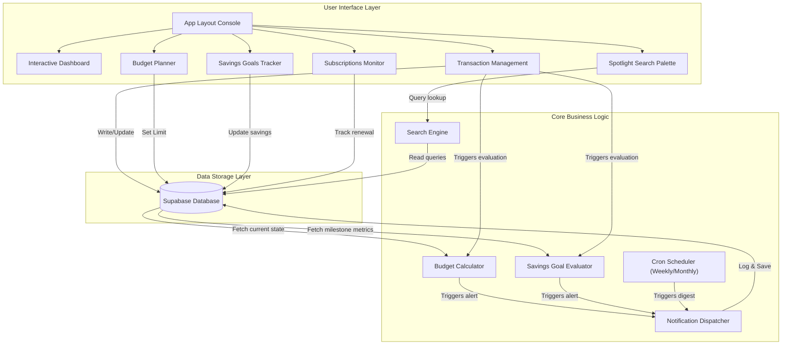
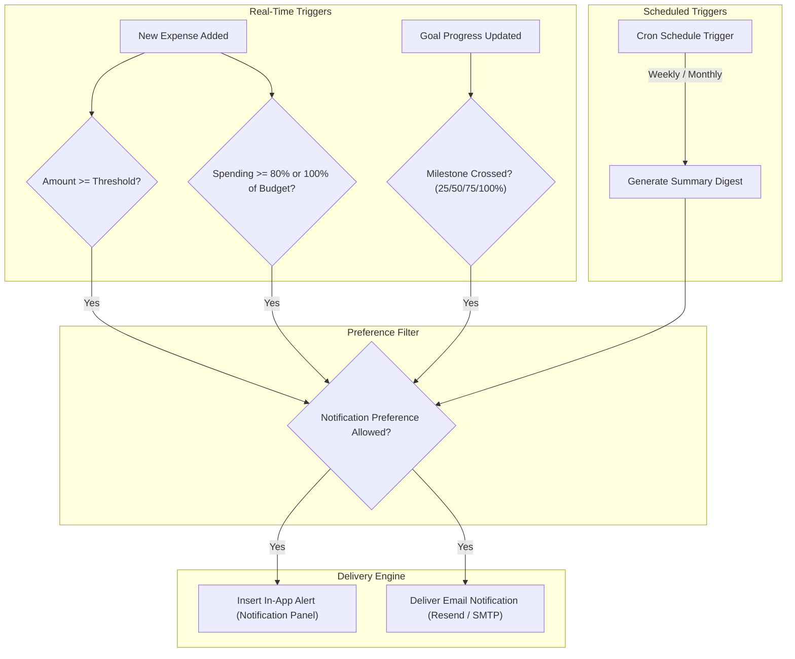
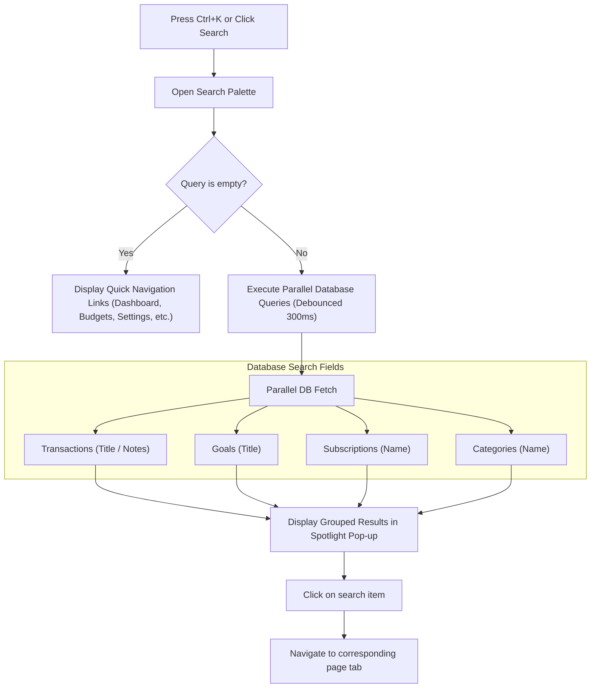

# FinTrack: End-to-End System Walkthrough

This document provides a comprehensive technical guide to the architecture, features, and data flows of the FinTrack personal finance tracking application.

---

## 1. High-Level Architecture Map

FinTrack is structured around a central database connected to several core modular engines that power the user dashboard, transaction tracking, budget controls, savings milestones, active subscriptions, notification dispatches, and the global search palette.

---

## 2. Core Features & Functional Design

### A. Dynamic Financial Dashboard
The dashboard provides a real-time, consolidated overview of the user's financial health:
- **Net Balance Metrics**: Sums net income and expenses to display total available liquidity.
- **Cash Flow Analytics**: Compares monthly incoming streams directly against outgoing categories using interactive visual charts.
- **Category breakdown**: Employs interactive visual distributions to pinpoint which category is consuming the largest share of expenditures.

### B. Transaction Management
Supports granular tracking of all financial activity:
- **Transactional Types**: Separates records into **Income** (increases net balance and savings capacity) and **Expenses** (depredates category budgets and net liquidity).
- **Categorization**: Binds transactions to specific categories to power budget aggregates.
- **Metadata Fields**: Users can supply transaction dates, notes, and payment methods to facilitate subsequent searches and filters.

### C. Category Configurations
Allows users to build a custom taxonomy for their expenses:
- **System Categories**: Pre-packaged defaults available to all users.
- **Custom Categories**: User-defined tags styled with unique icons and background color highlights to easily differentiate expense items visually.

### D. Budget Planning & Limits
Enforces monthly limit caps:
- **Category Budgets**: Users assign specific maximum spending caps on chosen categories.
- **Real-Time Aggregates**: When a new expense is recorded, the budget engine aggregates total expenditures for the current month in that category to calculate budget depletion.
- **Proactive Warnings**: Triggers warning updates when monthly category spending reaches **80%** or exceeds **100%** of the set budget limit.

### E. Savings Goals & Milestones
Encourages long-term savings:
- **Target Tracking**: Tracks target amounts against dynamic current savings.
- **Milestone Evaluation**: Evaluates saving progress changes to trigger milestone celebration notifications when crossing **25%**, **50%**, **75%**, or **100%** threshold limits.
- **Deadline Indicators**: Calculates time remaining until target goals expire.

### F. Subscription Monitoring
Manages recurring monthly or yearly expenses:
- **Renewal Alerts**: Tracks service names, billing cycles, and next billing dates.
- **Subscription Expenses**: Integrates renewal costs into monthly forecast metrics.

---

## 3. Real-Time and Scheduled Notification Pipeline

The notification engine keeps users informed about critical financial events through two primary mechanisms: real-time events and scheduled digests.

### Preference Verification
No notification is sent without checking the user's preferences:
- **Large Transaction Alerts**: Only triggered on **Expense** transactions that meet or exceed the user's custom threshold limit.
- **Budget Warnings**: Evaluated on expense records to notify users of category depletion. Built-in duplicate suppression ensures warning alerts are sent only once per level per month.
- **Goal Updates**: Milestone checks are evaluated upon updates to savings.
- **Scheduled Summaries**: Weekly spending breakdowns and monthly balance logs are prepared and delivered automatically via background schedulers.

---

## 4. Spotlight Search Engine

The spotlight search command menu acts as a global navigation hub, available anywhere in the interface via the search input trigger or the `Ctrl+K` / `⌘K` keyboard shortcut.

### Key Performance Controls
- **Debounced Fetching**: Keypresses are debounced by 300ms, ensuring database queries are only executed after the user pauses typing. This dramatically reduces resource usage.
- **Parallel Query Dispatching**: Dispatches search lookups for transactions, goals, subscriptions, and categories simultaneously to minimize network roundtrips.
- **Unified Amount Formatting**: Formats transaction prices and balances in real-time according to the user's chosen currency and numbering preferences.
- **Intelligent Focus & Dismissal**: Keybind listeners intercept default browser shortcut focus actions, allowing the modal to capture spotlight queries seamlessly. Dismisses on clicking outside the viewport or pressing `Escape`.
